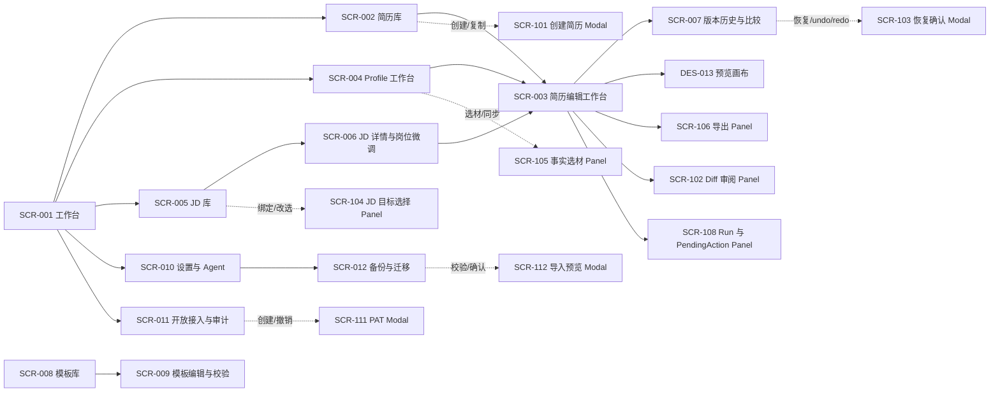

# Resumate 对话式简历编辑系统：v0.4 屏幕流定义

## 文档状态

| 项目 | 内容 |
| --- | --- |
| 阶段 | v0.4 Screen Flow Definition |
| 状态 | Draft：待线框评审与产品决策确认 |
| 输入 | [PRD](对话式简历编辑系统-PRD.md)、[用户故事索引](../user-stories/README.md)、[公共行为契约](../user-stories/contracts.md)、[定稿原型](../../ui/prototypes/index.html) |
| 适用范围 | P0 简历核心、Profile、JD 管理与岗位微调、Agent 运行与保存、开放接入、迁移、模板、设置与隐私审计 |
| 生成工单 | `30a67` |
| 置信度规则 | SCR/DES 当前为 2/5；线框评审或原型测试后目标提升至 4/5 |

## 1. 输入边界与推导口径

仓库当前没有独立的 `UJ-*`、`FEA-*`、`PER-*`、`MVP-SCOPE` 或 `BR-*` 文件。本文件使用稳定的推导标识，避免把未存在的前置工件描述成已确认事实：

- `UJ-Dxx`：从 PRD 第 5.2 节流程 A～E、用户故事 Epic 和 P0 结果推导的用户旅程。
- `FEA-Dxx`：从 PRD 第 5.3、7.2 和用户故事索引 P0 范围聚合的功能簇。
- `PER-Dxx`：从 PRD 第 3 节角色推导的界面约束。
- `BR-Dxx`：将 C-01～C-13 转译为界面必须呈现或阻止的行为约束；公共契约仍是唯一规范来源。
- `MVP-SCOPE`：采用用户故事索引中的 P0 范围；P1 与 EXT 只保留入口和扩展边界，不进入本期核心页面验收。

这些推导标识只服务屏幕流追溯。它们不替代产品、设计和工程后续建立的正式 UJ/FEA/PER/BR 工件。

### 1.1 推导角色

| ID | 角色 | 关键界面要求 | 证据 |
| --- | --- | --- | --- |
| PER-D01 | 求职者 | 需要同时理解岗位目标、事实来源、保存状态和 Agent 修改结果；允许无 Profile 创建空草稿 | PRD 3.1；US-1.1、US-1.5、US-7.1、US-11.6 |
| PER-D02 | 模板管理员 | 只管理模板资源，不接触求职者私有 Profile/Resume；需看到校验、发布和引用保护 | PRD 3.3；US-6.1、US-6.5～6.8 |
| PER-D03 | 外部 Agent 使用者 | 需要查看授权范围、轮次状态、PendingAction、幂等结果和冻结草稿 | PRD 3.2、5.2 流程 E；US-12.1、US-12.5、US-12.6 |
| PER-D04 | 集成开发者 | 需要能力发现、Token、Scope、契约版本、错误码和接入示例 | PRD 3.2、7.2 Epic E；US-12.4、US-12.8～12.13 |

### 1.2 推导旅程

| ID | 旅程 | 关键步骤 | P0 结果 |
| --- | --- | --- | --- |
| UJ-D01 | 创建并编辑岗位简历 | 选择创建入口 → 确定目标 → 创建草稿 → 编辑 → 审阅 Diff → 结算 → 导出 | US-1.1～1.5、US-1.7～1.11、US-2.1、US-3.*、US-5.1/5.2/5.4 |
| UJ-D02 | 从 Profile 生成岗位简历 | 选择 Profile/JD → 查看候选事实 → 确认选材 → 审阅首版 Diff → 结算 | US-7.*、US-8.* |
| UJ-D03 | 管理 JD 并进行岗位微调 | 保存/搜索 JD → 查看 revision 与绑定 → 选择目标 Resume → 直接微调或复制后微调 → 审阅并结算 | US-15.1～15.7、C-13 |
| UJ-D04 | 手动编辑、版本恢复与导出 | 编辑草稿 → 自动保存或主动 flush → 预览 → 查看/比较版本 → 恢复或撤销 → 固定版本导出 | US-1.5、US-4.*、US-5.*、US-11.3/11.5/11.6、C-03～C-06 |
| UJ-D05 | 使用 Agent 完成受控编辑 | 选择模式 → 发起 Run → 查看工具进度 → 审阅/确认/拒绝 → 取消或重试 → finalize | US-2.1/2.3/2.4、US-9.*、US-10.*、US-11.1、C-01～C-04、C-09 |
| UJ-D06 | 外部接入、迁移与恢复 | 创建 PAT → 发现能力 → 外部 Agent begin/apply/finalize → 查看访问日志 → 导出或导入备份 | US-12.*、C-07、C-10 |
| UJ-D07 | 管理模板、偏好与隐私 | 管理员编辑发布模板；求职者设置 Agent、模型、主题、语言、默认模板、自动保存和快捷键 | US-6.1、US-6.5～6.8、US-13.1～13.6、US-13.10～13.12 |

### 1.3 P0 功能簇

| ID | 功能簇 | 范围 | 主要证据 |
| --- | --- | --- | --- |
| FEA-D01 | 简历资源管理 | CRUD、搜索、排序、标签、复制、重命名、归档、软删除与恢复 | US-1.2/1.3/1.7～1.11 |
| FEA-D02 | 结构化简历编辑 | 基础信息、章节、稳定条目、字段校验、章节排序 | US-1.5；C-03 |
| FEA-D03 | 对话式内容编辑 | 自然语言意图、Patch、事实不足追问、运行进度、取消与重试 | US-2.1、US-2.4、C-09 |
| FEA-D04 | Diff 审阅与提交 | before/after、理由、来源、逐项接受/拒绝/编辑、PendingAction | US-3.1/3.2；C-01、C-04 |
| FEA-D05 | 版本与恢复 | 时间线、任意版本比较、restore、undo/redo、来源筛选 | US-4.1～4.4；C-03 |
| FEA-D06 | 预览与导出 | 草稿预览、正式版本预览、PDF/Markdown/JSON 导出、失败重试 | US-5.1/5.2/5.4；C-05 |
| FEA-D07 | 模板选择 | 模板切换、模板版本固定、模板渲染状态 | US-6.3；C-08 |
| FEA-D08 | Profile 事实源 | Profile、事实、证据、验证状态、可见性、搜索、反向引用 | US-7.1～7.11；C-07 |
| FEA-D09 | Profile 生成与同步 | JD 匹配、选材、生成简历、显式同步、事实晋升 | US-8.1～8.4；C-01、C-07 |
| FEA-D10 | JD 管理 | CRUD、搜索、revision、来源、标签、详情 | US-15.1～15.3；C-13 |
| FEA-D11 | JD 软绑定与微调 | 绑定/换绑/解绑、目标选择、直接微调、复制后微调、快照 | US-15.4～15.7；C-13 |
| FEA-D12 | 保存与并发 | Working Copy、自动保存、flush、409、冲突草稿、异常恢复 | US-11.1/11.3/11.5/11.6；C-03～C-06 |
| FEA-D13 | Agent 模式与预算 | approval、Full Access、模式来源、预算、Run 固化 | US-9.1/9.2、US-10.1～10.3；C-01/02/09 |
| FEA-D14 | 公共接入与授权 | PAT、Scope、能力发现、MCP/SDK 状态、撤销 | US-12.1/12.2/12.4/12.5/12.8～12.13；C-07、C-10 |
| FEA-D15 | 备份迁移 | 完整 JSON 备份、Markdown 索引、导入校验、映射预览 | US-12.3、US-12.7；C-07 |
| FEA-D16 | 模板生命周期 | 模板草稿、预览校验、发布、下架、删除保护、版本 | US-6.1、US-6.5～6.8；C-08 |
| FEA-D17 | 设置与隐私审计 | 模型、Agent、主题、语言、头像昵称、默认模板、自动保存、快捷键、审计 | US-13.1～13.6、US-13.10～13.12；C-01、C-02、C-10 |

## 2. 信息架构与导航模式

采用 **Hub & Spoke** 作为主模式，简历编辑和岗位微调内部使用短 **Linear Flow**。首页工作台是入口，核心资源通过全局导航切换；创建、确认、恢复、导出和导入使用 Modal/Panel，避免为每个一次性动作增加页面。

### 2.1 全局导航

- **主导航**：工作台、简历、Profile、JD、设置；模板库仅对模板管理员显示；开放接入与备份迁移收纳在设置下。
- **当前资源上下文**：简历编辑工作台始终显示 Resume 标题、状态、当前正式版本、草稿状态、关联 JD 和当前 Run；切换资源前先按 C-02/C-05 结算或明确失败。
- **可返回路径**：每个页面保留面包屑或返回入口；Panel/Modal 始终返回触发页面；已关闭 UserTurn 的迟到写入只在状态区呈现错误，不创建隐式新页面。
- **角色隔离**：管理员模板页面与求职者私有资料页面分离；模板管理员不因进入模板页面获得 Profile/Resume 内容访问权。
- **P1/EXT**：面试入口可在首页和简历详情中预留 disabled/coming-soon 状态，不能伪装成可完成的 P0 流程。

## 3. SCR 页面与流程条目

### SCR-001：求职工作台

- **Type**：Page；Entry Point；P0 高优先级
- **Purpose**：展示当前求职阶段、最新简历、未提交草稿、待处理 Agent 操作和快速创建入口。
- **Journeys**：UJ-D01 Step 1；UJ-D02 Step 1；UJ-D03 Step 1；UJ-D04 Step 1；UJ-D05 Step 1；UJ-D07 Step 1
- **Features**：FEA-D01、FEA-D03、FEA-D08、FEA-D10、FEA-D13、FEA-D17
- **Confidence**：2/5（来源：PRD 5.2、定稿原型、US-1.6/2.4/13.*；尚未线框验证）
- **Primary Actions**：继续编辑最新简历；创建简历；建立 Profile；保存 JD；处理待确认动作。
- **Secondary Actions**：进入版本历史；打开设置；查看失败、冲突和冻结草稿；进入面试扩展入口。
- **Navigation**：From：首次进入或全局导航；To：SCR-002、SCR-003、SCR-004、SCR-005、SCR-010、SCR-011。
- **Content**：最新简历卡片；草稿/未提交数量；PendingAction 摘要；最新 JD；Profile 完整度与待核实事实；求职阶段进度。
- **States**：首次使用空状态；资源加载；有待确认；有未提交草稿；有冲突/冻结草稿；服务失败可重试。
- **Constraints**：BR-D01（不把本地未送达输入标为已保存）；BR-D02（模式和待办状态来自服务端）；BR-D05（资源私有）；BR-D07（P1/EXT 不可冒充可用）。
- **Design Notes**：沿用应用既有令牌（`background` / `foreground` / `coral` / `cobalt` / `gold`、`card-frame` 与 `card-soft` 两种卡片、键盘焦点环）；`ui/prototypes/index.html` 的 `#screen-workbench` 是这一屏的视觉基线。
- **Next Target**：线框验证 3 类状态（无 Profile、有草稿、有待确认）后提升至 4/5。

### SCR-002：简历库

- **Type**：Page；Core Workflow；P0 高优先级
- **Purpose**：搜索、排序、筛选和管理多份 Resume，明确活跃、归档和已删除状态。
- **Journeys**：UJ-D01 Step 1/2；UJ-D04 Step 1；UJ-D03 Step 4
- **Features**：FEA-D01、FEA-D07、FEA-D11
- **Confidence**：2/5（来源：US-1.2/1.3/1.7～1.10、C-08、C-13；尚未线框验证）
- **Primary Actions**：搜索标题；按更新时间降序排序；按标签和时间筛选；打开编辑；复制；创建；归档；恢复。
- **Secondary Actions**：重命名；软删除；查看关联 JD；打开版本历史；进入导出。
- **Navigation**：From：SCR-001、SCR-005；To：SCR-003、SCR-007、SCR-101；Panel：SCR-110。
- **Content**：Resume 标题、岗位方向、标签、模板版本、当前正式版本、上次编辑时间、保存状态、关联 JD、归档/删除标识。
- **States**：加载；无简历首次使用；无匹配结果且保留筛选；活跃列表；归档列表；删除恢复窗口；绑定 Resume 不可用。
- **Constraints**：BR-D03（切换前 flush）；BR-D04（重命名/归档/模板切换不生成内容版本）；BR-D06（删除展示恢复截止时间，具体期限依赖 D-01）。
- **Design Notes**：网格卡片（`lg` 两列、`xl` 三列，更窄回落单列）必须让“内容版本”“元数据变化”“草稿状态”分层显示，避免把重命名误解为内容提交；四颗操作按钮在三列宽度下保持一行、同排卡片操作区贴底。
- **Next Target**：以 5 份简历、同名简历和无匹配筛选完成可用性测试后提升至 4/5。

### SCR-003：简历编辑工作台

- **Type**：Page；Core Workflow；P0 最高优先级
- **Purpose**：在一个稳定工作区内完成结构化编辑、对话编辑、Diff 审阅、预览、模板选择、版本和导出。
- **Journeys**：UJ-D01 全程；UJ-D02 Step 4/5；UJ-D03 Step 4/5；UJ-D04 全程；UJ-D05 全程
- **Features**：FEA-D02～FEA-D07、FEA-D09、FEA-D11～FEA-D13
- **Confidence**：2/5（来源：US-1.5、US-2.1/2.3/2.4、US-3.*、US-4.*、US-5.*、US-6.3、C-03～C-06；尚未线框验证）
- **Primary Actions**：编辑字段；调整章节；发送编辑意图；查看和处理 Diff；保存/flush；切换模板；预览；导出；查看版本。
- **Secondary Actions**：恢复、undo/redo；从 Profile 选材；显示关联 JD；打开审计来源；取消 Run。
- **Navigation**：From：SCR-001、SCR-002、SCR-004、SCR-006；To：SCR-007、SCR-106、SCR-102；Panels：SCR-104、SCR-105、SCR-108、SCR-109。
- **Content**：左侧结构导航与章节编辑；中间对话、Run 进度和待办；右侧草稿/正式版本预览；顶部 Resume、JD、模式、版本、保存状态；底部可访问的 Diff/冲突通知。
- **Layout Contract**：三栏可折叠；窄屏按“编辑 → 对话 → 预览”顺序切换；当前目标、来源和提交状态在折叠后仍可访问。
- **States**：空草稿；加载；本地草稿；服务端已收草稿；未提交；待确认；已提交；渲染失败保留旧成功预览；409 冲突；授权撤销冻结；Turn 已关闭。
- **Constraints**：BR-D01（保存状态必须基于服务端确认）；BR-D02（Run 模式服务端固化）；BR-D03（切换、离开、导出前 flush）；BR-D04（每份 Resume 每轮最多一个版本）；BR-D08（JD revision/Resume 基线变化使旧确认失效）。
- **Design Notes**：定稿原型的“工作台”方向可复用，但 P0 需要以内容编辑和证据审阅为中心，进度卡不能遮挡 Diff 和版本状态。
- **Next Target**：用 UJ-D01、UJ-D03、UJ-D05 的成功/取消/冲突三组任务做原型测试后提升至 4/5。

### SCR-004：Profile 事实工作台

- **Type**：Page；Core Workflow；P0 高优先级
- **Purpose**：维护完整职业事实、证据、验证状态、可见性和 Profile 版本。
- **Journeys**：UJ-D02 全程；UJ-D01 Step 3；UJ-D04 Step 5；UJ-D06 Step 5
- **Features**：FEA-D08、FEA-D09、FEA-D14、FEA-D15
- **Confidence**：2/5（来源：US-7.1～7.11、US-8.1～8.4、C-07；尚未线框验证）
- **Primary Actions**：创建/选择 Profile；新增和编辑事实；搜索筛选；标记已核实；按 JD 匹配；查看事实引用；生成岗位简历。
- **Secondary Actions**：比较/恢复 Profile 版本；删除事实；调整可见性；预览显式同步；导出完整备份。
- **Navigation**：From：SCR-001、SCR-003、SCR-012；To：SCR-003、SCR-007；Panels：SCR-105、SCR-107、SCR-103。
- **Content**：事实分类与时间线；内容、标签、来源、证据、confidence、verified_at、visibility；被哪些 Resume/Version 使用；JD 匹配结果和证据缺口。
- **States**：无 Profile；无事实；无匹配素材；待核实；证据不可访问；Token 字段不可见；有引用删除影响；Profile 版本冲突。
- **Constraints**：BR-D05（默认私有）；BR-D09（不能把模型推断当事实或证据）；BR-D10（Profile 更新不静默改写 Resume）；BR-D11（选材和事实晋升始终显式确认）。
- **Design Notes**：先显示“事实可信度和来源”，再显示“适合哪些岗位”；事实卡需允许用户理解空缺，而不是用 AI 摘要掩盖依据不足。
- **Next Target**：用“有证据/待核实/被两份简历引用/不可见字段”四种事实卡验证后提升至 4/5。

### SCR-005：JD 库

- **Type**：Page；Core Workflow；P0 高优先级
- **Purpose**：集中保存、搜索、筛选和进入岗位详情，显示每个 JD 的 revision 与当前软绑定。
- **Journeys**：UJ-D03 Step 1/2；UJ-D02 Step 1；UJ-D06 Step 5
- **Features**：FEA-D10、FEA-D11、FEA-D15
- **Confidence**：2/5（来源：US-15.1～15.3、C-13；尚未线框验证）
- **Primary Actions**：新增 JD；按岗位、公司、标签搜索；打开详情；发起岗位微调；绑定/换绑/解绑。
- **Secondary Actions**：编辑产生新 revision；删除；查看关联 Resume；导出备份。
- **Navigation**：From：SCR-001、SCR-003；To：SCR-006、SCR-003、SCR-002；Panels：SCR-104、SCR-110。
- **Content**：岗位名称、公司、标签、来源链接、revision、更新时间、绑定 Resume、不可用绑定警示。
- **States**：空列表；搜索无结果；未绑定；已绑定；绑定 Resume 已删除/不可访问；JD 有历史快照；新 revision 待重新计算。
- **Constraints**：BR-D08（一个 JD 当前最多绑定一份 Resume）；BR-D12（改选微调目标不自动换绑）；BR-D13（删除 JD 不删除 Resume 和历史快照）。
- **Design Notes**：把“当前绑定”和“本次微调目标”拆成两个明确字段；不可用绑定不能自动替换为更新时间最新的简历。
- **Next Target**：用绑定 A、改选 B、复制 C 和 JD revision 变化四个场景完成线框评审后提升至 4/5。

### SCR-006：JD 详情与岗位微调

- **Type**：Page；Core Workflow；P0 最高优先级
- **Purpose**：查看岗位原文和 revision，明确选择微调目标、直接修改或复制后修改，并进入岗位相关 Diff。
- **Journeys**：UJ-D03 Step 2～6；UJ-D02 Step 1/2
- **Features**：FEA-D10、FEA-D11、FEA-D03、FEA-D04、FEA-D12
- **Confidence**：2/5（来源：US-15.2～15.7、C-13；尚未线框验证）
- **Primary Actions**：选择 Resume；选择直接微调/复制后微调；预览匹配理由；发起 Agent 任务；绑定/换绑/解绑；打开目标编辑器。
- **Secondary Actions**：编辑 JD；查看历史 revision；删除 JD；查看被多个 JD 引用的影响。
- **Navigation**：From：SCR-005、SCR-001；To：SCR-003、SCR-002；Panels：SCR-104、SCR-102、SCR-110。
- **Content**：JD 原文、岗位元数据、当前 revision、当前绑定、候选 Resume、目标基线、直接修改影响、复制后副本摘要、历史快照。
- **States**：未绑定需先选；已绑定默认预选；改选其他 Resume；复制待确认；JD revision 变化；Resume 基线冲突；绑定目标不可用。
- **Constraints**：BR-D08（JD revision 与 Resume 基线双重校验）；BR-D11（复制创建需确认）；BR-D12（本次目标不等于当前绑定）；BR-D13（失败保留原绑定）。
- **Design Notes**：页面顶部用固定摘要锁定“JD revision + Resume 基线 + 操作方式”，用户提交前可复核写入目标。
- **Next Target**：完成一组包含 J1→J2 失效确认的交互原型后提升至 4/5。

### SCR-007：版本历史与比较

- **Type**：Page；Core Workflow；P0 高优先级
- **Purpose**：查看不可变 Resume/Profile 版本、来源、Diff、父子关系并发起恢复。
- **Journeys**：UJ-D04 Step 4/5；UJ-D01 Step 7；UJ-D02 Step 5；UJ-D03 Step 5；UJ-D06 Step 4
- **Features**：FEA-D05、FEA-D06、FEA-D08、FEA-D11、FEA-D15
- **Confidence**：2/5（来源：US-4.1～4.4、US-7.3、C-03、C-07；尚未线框验证）
- **Primary Actions**：浏览时间线；选择两个版本比较；查看来源；预览快照；发起 restore/undo/redo。
- **Secondary Actions**：按 manual/agent/client/mode 筛选；复制版本标识；导出当前版本。
- **Navigation**：From：SCR-003、SCR-004、SCR-001；To：SCR-003；Modal：SCR-103；Panel：SCR-102。
- **Content**：版本 ID、时间、作者、source、client、mode、UserTurn/Run、父版本、基线、摘要、变更章节、JD/Profile 快照。
- **States**：无历史；同版比较无差异；版本来源字段不适用；恢复待确认；redo 分支失效；版本读取失败。
- **Constraints**：BR-D04（恢复通过新版本表达）；BR-D10（Profile 恢复不改写已有 Resume）；BR-D14（历史快照不可被新 revision 影响）。
- **Design Notes**：时间线与 Diff 必须同时可见或一键往返；不可把“恢复目标”呈现为已提交版本。
- **Next Target**：用 V1/V3 非相邻比较、恢复、undo 后新编辑三组任务验证后提升至 4/5。

### SCR-008：模板库

- **Type**：Page；Settings/Admin；P0 中优先级
- **Purpose**：模板管理员查看模板草稿、已发布、下架和引用状态，控制可选模板集合。
- **Journeys**：UJ-D07 Step 1/2；UJ-D01 Step 3
- **Features**：FEA-D07、FEA-D16
- **Confidence**：2/5（来源：US-6.1、US-6.5～6.8、C-08；尚未线框验证）
- **Primary Actions**：新建模板；打开编辑；发布；下架；重新上架。
- **Secondary Actions**：筛选状态；查看引用 Resume 数量；删除无引用模板；查看历史修订。
- **Navigation**：From：管理员全局导航；To：SCR-009；与求职者私有资源隔离。
- **Content**：模板名称、状态、当前修订、校验状态、引用数量、发布者、发布时间、下架原因。
- **States**：无模板；草稿；校验失败；已发布；下架仍有引用；删除保护。
- **Constraints**：BR-D15（已引用模板不能物理删除）；BR-D16（新修订不改变已有 Resume 的模板版本）。
- **Design Notes**：管理页面突出“可新选用”和“已有引用仍可用”的区别。
- **Next Target**：管理员完成草稿→校验→发布→下架→删除保护完整任务后提升至 4/5。

### SCR-009：模板编辑与校验

- **Type**：Page；Settings/Admin；P0 中优先级
- **Purpose**：编辑模板布局、样式、分页和导出配置，查看渲染校验并提交发布。
- **Journeys**：UJ-D07 Step 1/2
- **Features**：FEA-D16
- **Confidence**：2/5（来源：US-6.1、US-6.5/6.8、C-08；D-03 边界参数未冻结）
- **Primary Actions**：编辑配置；运行校验；查看边界样例；保存草稿；发布修订。
- **Secondary Actions**：恢复旧修订；查看引用；返回模板库。
- **Navigation**：From：SCR-008；To：SCR-008。
- **Content**：布局、样式、分页、纸张、字体、边界样例、溢出/截断/分页错误、发布摘要。
- **States**：草稿；校验中；通过；有未解决错误；发布确认；版本冲突。
- **Constraints**：BR-D16；D-03 未冻结前只能作为设计占位，不宣称满足视觉容差。
- **Design Notes**：只呈现模板样例或脱敏内容，不加载求职者私有 Profile/Resume 以模拟真实引用。
- **Next Target**：D-03 冻结并完成边界样例线框后提升至 4/5。

### SCR-010：设置与 Agent 运行配置

- **Type**：Page；Settings/Admin；P0 中优先级
- **Purpose**：管理模型凭证状态、Agent 配置、执行模式、预算、主题、语言、头像昵称、自动保存、默认模板、导出配置和快捷键。
- **Journeys**：UJ-D05 Step 1；UJ-D07 Step 2；UJ-D01 Step 1
- **Features**：FEA-D13、FEA-D17
- **Confidence**：2/5（来源：US-9.1、US-10.*、US-13.1～13.6、US-13.10～13.12、C-01/02/09；D-02/D-04 部分未冻结）
- **Primary Actions**：设置模式；配置 Agent 和预算；配置模型；测试连接；设置自动保存和默认模板；切换主题/语言；设置快捷键。
- **Secondary Actions**：查看当前 Run 快照；查看凭证配置状态；恢复默认设置。
- **Navigation**：From：SCR-001、SCR-003；To：SCR-011、SCR-012；Panel：SCR-108。
- **Content**：当前 Run 模式与后续 Run 模式；模式来源；预算使用；Provider/endpoint/model；密钥已配置状态；用户偏好；快捷键冲突。
- **States**：保存中；保存成功；连接失败；凭证已配置不回显；当前 Run 固化旧模式；默认模板已下架；快捷键冲突。
- **Constraints**：BR-D02（Run 固化）；BR-D17（凭证不回显）；BR-D18（提示词不能绕过权限）；D-02、D-04 未冻结项明确标待决。
- **Design Notes**：把“当前运行”和“后续默认”分成两个区域，避免用户误以为修改设置会改变运行中的权限。
- **Next Target**：完成 approval/Full Access、运行中切换、密钥回显和默认模板失效测试后提升至 4/5。

### SCR-011：开放接入与访问审计

- **Type**：Page；Settings/Admin；P0 中优先级
- **Purpose**：创建、查看、撤销 PAT，查看 Scope/资源/字段/用途/期限和访问日志，并展示公共接入能力。
- **Journeys**：UJ-D06 全程；UJ-D05 Step 1/5
- **Features**：FEA-D14、FEA-D17
- **Features Boundary**：MCP、TypeScript SDK、Python SDK、能力发现和 REST 契约在此说明；页面不代替客户端实现。
- **Confidence**：2/5（来源：US-12.1/12.2/12.4/12.5/12.8～12.13、US-13.5、C-07/C-10；尚未线框验证）
- **Primary Actions**：创建最小权限 PAT；查看授权范围；撤销 Token；查看访问日志；复制能力发现地址和契约版本。
- **Secondary Actions**：筛选客户端/资源/结果；查看冻结草稿；打开接入指南。
- **Navigation**：From：SCR-001、SCR-010；To：SCR-012；Modals：SCR-111；Panels：SCR-108/109。
- **Content**：Token 名称、Scope、资源、字段、用途、创建/到期时间、上次使用时间、状态；访问记录；契约版本、OpenAPI/MCP 入口。
- **States**：无 Token；仅首次显示凭证；已撤销；即将到期；访问被拒；撤销后冻结草稿；幂等结果需重新授权。
- **Constraints**：BR-D05（私有资源）；BR-D19（Token 不能伪造 manual/full_access）；BR-D20（撤销后不能读取幂等缓存）；D-04 Webhook 策略仍待定。
- **Design Notes**：敏感凭证只在创建成功态显示一次，后续只显示已配置标记和轮换/撤销入口。
- **Next Target**：以 profile:read + resume:write、字段裁剪、撤销冻结和访问日志四组场景验证后提升至 4/5。

### SCR-012：备份与迁移

- **Type**：Page；Settings/Admin；P0 中优先级
- **Purpose**：导出完整个人资料和历史，导入公开 JSON 备份并在确认前完成引用校验和映射预览。
- **Journeys**：UJ-D06 Step 3/4；UJ-D04 Step 6
- **Features**：FEA-D06、FEA-D14、FEA-D15
- **Confidence**：2/5（来源：US-5.4、US-12.3/12.7、C-07；D-05 仅影响 P1 文档导入，不阻塞 JSON 备份）
- **Primary Actions**：导出完整 JSON/Markdown；选择备份文件；校验格式与引用；预览新资源和 ID 映射；确认导入。
- **Secondary Actions**：查看不可导出附件清单；取消导入；下载校验报告。
- **Navigation**：From：SCR-010、SCR-011；To：SCR-002、SCR-004、SCR-005；Modal：SCR-112。
- **Content**：备份版本、资源计数、版本树、Profile/Resume/JD 关系、绑定映射、JD 快照、附件可迁移性、错误清单。
- **States**：无备份；校验中；引用完整；缺失引用；附件不可导出；确认前预览；导入成功；导入整体失败不留部分资源。
- **Constraints**：BR-D21（导入后新资源归属当前用户）；BR-D22（历史 actor 只作来源）；BR-D23（未映射绑定报告为未绑定）。
- **Design Notes**：用“新增资源”和“不会覆盖的现有资源”分栏，避免同名资源误认为会合并。
- **Next Target**：用多版本、JD 绑定、缺失事实引用和不可下载附件备份完成验收原型后提升至 4/5。

## 4. Modal 与 Panel 条目

### SCR-101：创建简历 Modal

- **Type**：Modal；Linear Flow；P0 高优先级
- **Purpose**：让用户用两条链路开始一份简历——从现有简历复制，或完全新开空稿；标题、岗位、模板与来源进入编辑器后再补齐。
- **Journeys**：UJ-D01 Step 1～3；UJ-D03 Step 3
- **Features**：FEA-D01
- **Confidence**：2/5（来源：US-1.11、C-01）
- **Primary Actions**：第一步选择「从现有简历复制」或「完全新开」；复制链路点「创建」进入第二步的大弹层简历选择层，用网格卡片选定一份简历后点「创建副本」；完全新开点「创建」即创建。
- **Secondary Actions**：取消；切换创建链路；选择层取消回到第一步。
- **Navigation**：From：SCR-001、SCR-002；To：SCR-003。
- **States**：复制选中；完全新开选中；选择层空态（无活跃简历）；选择层已选 / 未选；选择层提交中；无活跃简历（复制链路不可选）；无已发布模板（完全新开不可提交）；创建失败可重试。
- **Constraints**：第一步点「创建」在复制链路上不产生任何资源，只切换到选择层；选择层只列活跃简历（归档不列），网格卡片展示标题、岗位、标签、模板 rev 与上次编辑；复制产物是独立简历，标题由后端追加「（副本）」；完全新开的标题与模板取默认值、文档为空，不在此处收集来源与 JD；显式提交视为授权（C-01）。对话创建（US-1.1）、Profile 生成与 Profile 预填充（FEA-D09、UJ-D02）已移出本弹窗，待 Agent 选材生成落地后另行定义入口。
- **Next Target**：用两条链路各完成一次首用路径测试后提升至 4/5。

### SCR-102：Diff 审阅 Panel

- **Type**：Panel；Core Workflow；P0 最高优先级
- **Purpose**：展示待审或已提交修改的目标、before/after、字段/行级变化、理由、事实来源和提交状态。
- **Journeys**：UJ-D01 Step 5～7；UJ-D02 Step 3～5；UJ-D03 Step 4～6；UJ-D04 Step 4；UJ-D05 Step 3～5
- **Features**：FEA-D03、FEA-D04、FEA-D09、FEA-D11、FEA-D12、FEA-D13
- **Confidence**：2/5（来源：US-3.1/3.2、C-01、C-03、C-13）
- **Primary Actions**：逐项接受、拒绝、编辑后接受；全部接受；拒绝；重新生成；查看依赖错误；确认高影响操作。
- **Secondary Actions**：复制内容；查看来源；打开目标 Resume/JD/Profile；查看旧预览。
- **Navigation**：From：SCR-003、SCR-006、SCR-007；To：SCR-003。
- **States**：待确认；已部分接受；全部接受；确认失效；JD/基线过期；冲突；无内容变化；失败保留草稿。
- **Constraints**：颜色不是唯一变化信号；旧目标/基线/负载变化必须失效；未批准内容不能进入 Working Copy。
- **Next Target**：用逐项依赖、旧确认失效和无变化三组任务验证后提升至 4/5。

### SCR-103：恢复确认 Modal

- **Type**：Modal；High-impact Action；P0 高优先级
- **Purpose**：在 restore、undo、redo、删除恢复前展示目标快照、反向 Diff、影响和确认边界。
- **Journeys**：UJ-D04 Step 4/5；UJ-D01 Step 7；UJ-D02 Step 5
- **Features**：FEA-D05、FEA-D08、FEA-D12、FEA-D13
- **Confidence**：2/5（来源：US-2.3、US-4.3、US-7.3、C-01、C-03）
- **Primary Actions**：确认恢复；取消；查看目标版本；查看受影响 JD/Profile 来源。
- **Secondary Actions**：切换候选版本；返回 Diff。
- **Navigation**：From：SCR-007、SCR-004；To：SCR-003 或原页面。
- **States**：待确认；目标已过期；redo 已失效；无可操作项；恢复成功/失败。
- **Constraints**：Full Access 仍需确认；恢复产生新版本；不能覆盖历史。
- **Next Target**：完成版本候选与新编辑使 redo 失效测试后提升至 4/5。

### SCR-104：Resume 目标选择 Panel

- **Type**：Panel；Contextual Selection；P0 高优先级
- **Purpose**：明确 JD 当前绑定、此次微调目标、直接修改/复制后修改和多 JD 影响。
- **Journeys**：UJ-D03 Step 3/4；UJ-D01 Step 2
- **Features**：FEA-D01、FEA-D10、FEA-D11、FEA-D12
- **Confidence**：2/5（来源：US-15.4～15.6、C-13）
- **Primary Actions**：选择可访问 Resume；选择直接或复制；确认目标；选择是否显式绑定此 Resume。
- **Secondary Actions**：查看关联 JD；打开 Resume；刷新候选列表。
- **Navigation**：From：SCR-005、SCR-006、SCR-101；To：SCR-003、SCR-006。
- **States**：未绑定；已预选绑定；改选；目标不可用；同一 Resume 被多个 JD 引用；复制待确认。
- **Constraints**：不能默认更新时间最新的 Resume；改选不自动换绑；删除/归档状态按可访问性展示。
- **Next Target**：用 A 绑定、B 改选、C 副本三路任务验证后提升至 4/5。

### SCR-105：Profile 事实选材与同步 Panel

- **Type**：Panel；Contextual Selection；P0 高优先级
- **Purpose**：展示 JD 匹配事实、证据、confidence、理由、缺口和可选同步变化。
- **Journeys**：UJ-D02 Step 2～4；UJ-D04 Step 5
- **Features**：FEA-D08、FEA-D09、FEA-D11
- **Confidence**：2/5（来源：US-7.4/7.9/7.10、US-8.1/8.3/8.4、C-01/C-07）
- **Primary Actions**：选择事实；查看证据；确认选材；选择同步变化；拒绝事实晋升。
- **Secondary Actions**：打开 Profile 事实；查看相似事实；补充缺口。
- **Navigation**：From：SCR-004、SCR-006、SCR-003；To：SCR-003 或 SCR-004。
- **States**：匹配结果；证据不足；不可见字段裁剪；选材已确认；同步待确认；事实晋升待确认。
- **Constraints**：不能把推测写成事实；Full Access 仍需确认选材、同步和事实晋升。
- **Next Target**：完成“有依据/无依据/不可见”三组内容测试后提升至 4/5。

### SCR-106：预览与导出 Panel

- **Type**：Panel；Core Workflow；P0 高优先级
- **Purpose**：固定 Resume 版本、模板版本和导出配置，预览同一输入并导出 PDF/Markdown/JSON。
- **Journeys**：UJ-D01 Step 7；UJ-D04 Step 2～6；UJ-D03 Step 6
- **Features**：FEA-D06、FEA-D07、FEA-D12
- **Confidence**：2/5（来源：US-5.1/5.2/5.4、US-6.3、C-05、D-03）
- **Primary Actions**：查看草稿/正式预览；选择模板；选择格式；导出；重试失败任务。
- **Secondary Actions**：查看版本标识；打开编辑；下载错误报告。
- **Navigation**：From：SCR-003、SCR-007；To：SCR-003。
- **States**：草稿预览；正式版本；flush 中；导出中；渲染失败保留旧预览；下载成功；失败可重试。
- **Constraints**：导出前 flush；导出不产生内容版本；PDF/预览使用同一版本、模板和配置；D-03 未冻结时显示待决验收口径。
- **Next Target**：D-03 冻结并完成成功/失败/无变化测试后提升至 4/5。

### SCR-107：事实编辑与引用影响 Panel

- **Type**：Panel；Contextual Edit；P0 中优先级
- **Purpose**：编辑事实、证据、验证状态和可见性，展示删除或更正影响。
- **Journeys**：UJ-D02 Step 2；UJ-D04 Step 5；UJ-D06 Step 5
- **Features**：FEA-D08、FEA-D09、FEA-D17
- **Confidence**：2/5（来源：US-7.1、US-7.5～7.10、C-07）
- **Primary Actions**：编辑事实；上传/关联证据；标记核实；设置可见性；确认删除。
- **Secondary Actions**：查看引用 Resume/Version；取消编辑；打开来源快照。
- **Navigation**：From：SCR-004；To：SCR-004、SCR-003。
- **States**：新建；编辑；待核实；有引用；不可见；删除确认；保存失败。
- **Constraints**：删除前展示反向引用；已有 Resume 快照保持不变；证据不可下载时不能伪造可迁移状态。
- **Next Target**：覆盖事实被两份简历引用和 Token 不可见字段后提升至 4/5。

### SCR-108：Run、模式与 PendingAction Panel

- **Type**：Panel；Runtime Control；P0 最高优先级
- **Purpose**：展示当前 Agent Run 的模式、来源、预算、工具进度、PendingAction、取消与最终结算状态。
- **Journeys**：UJ-D05 全程；UJ-D01 Step 5～7；UJ-D03 Step 4～6；UJ-D06 Step 3/4
- **Features**：FEA-D03、FEA-D04、FEA-D12、FEA-D13、FEA-D14
- **Confidence**：2/5（来源：US-2.4、US-9.*、US-10.*、US-11.1、US-12.6、C-01～C-04、C-09）
- **Primary Actions**：查看步骤；确认/拒绝绑定待办；取消 Run；重试失败任务；显式 finalize；查看结果。
- **Secondary Actions**：查看工具调用；查看预算；查看资源目标；切换后续模式设置。
- **Navigation**：From：SCR-003、SCR-010、SCR-011；To：SCR-003、SCR-007。
- **States**：运行中；待确认；已批准；已拒绝；取消中；部分成功；超预算；失败；权限撤销冻结；Turn 已关闭。
- **Constraints**：控制事件留在原轮次；独立新任务才开启新轮次；迟到写入显示 `TURN_ALREADY_CLOSED`；外部 Agent 使用 begin/finalize。
- **Next Target**：完成 cancel、retry、token revoke、new task 四路状态机测试后提升至 4/5。

### SCR-109：并发冲突与冻结草稿 Panel

- **Type**：Panel；Recovery；P0 高优先级
- **Purpose**：展示最新正式版本、冲突草稿、双方 Diff 和重新计算/重新审阅入口。
- **Journeys**：UJ-D04 Step 2；UJ-D05 Step 5；UJ-D06 Step 4
- **Features**：FEA-D04、FEA-D05、FEA-D12、FEA-D14
- **Confidence**：2/5（来源：US-2.4、US-11.5/11.6、US-12.5、C-04/C-06）
- **Primary Actions**：读取最新版本；重新生成 Diff；选择保留内容；新轮次重试；恢复冻结草稿。
- **Secondary Actions**：下载冲突摘要；查看授权撤销原因；取消草稿。
- **Navigation**：From：SCR-003、SCR-011、SCR-108；To：SCR-003、SCR-007。
- **States**：409；冲突待处理；Token 撤销冻结；浏览器异常恢复；重试成功；重试失败。
- **Constraints**：不覆盖最新正式版本；权限撤销时不可自动 finalize；所有者新轮次重新审阅后才可恢复。
- **Next Target**：以手动领先 Agent、授权撤销和异常关闭三个边界任务验证后提升至 4/5。

### SCR-110：资源生命周期确认 Modal

- **Type**：Modal；High-impact Action；P0 中优先级
- **Purpose**：确认 Resume/JD/Profile/模板的删除、归档、解绑、软删除恢复和影响范围。
- **Journeys**：UJ-D01 Step 2；UJ-D02 Step 2；UJ-D03 Step 2/6；UJ-D07 Step 2
- **Features**：FEA-D01、FEA-D08、FEA-D10、FEA-D11、FEA-D16
- **Confidence**：2/5（来源：US-1.8/1.9、US-7.7/7.11、US-15.6/15.7、US-6.6/6.7、C-01/C-08/C-13）
- **Primary Actions**：确认；取消；查看影响；选择换绑/解绑。
- **Secondary Actions**：进入恢复窗口；打开引用列表；下载影响摘要。
- **Navigation**：From：SCR-002、SCR-004、SCR-005、SCR-008；To：原页面。
- **States**：可恢复；恢复窗口已过；有引用不能删除；绑定不可用；删除失败；元数据已更新。
- **Constraints**：删除 JD 不级联 Resume；已引用模板不能物理删除；删除事实/档案必须展示影响。
- **Next Target**：完成资源类型逐一确认并验证失败保留原状态后提升至 4/5。

### SCR-111：PAT 创建与撤销 Modal

- **Type**：Modal；Security/Settings；P0 中优先级
- **Purpose**：创建最小权限 Token，展示一次凭证，并让用户确认 Scope、资源、字段、用途和期限。
- **Journeys**：UJ-D06 Step 1/4；UJ-D05 Step 1
- **Features**：FEA-D14、FEA-D17
- **Confidence**：2/5（来源：US-12.2、US-12.5、C-07、C-10）
- **Primary Actions**：选择权限；确认创建；复制一次性凭证；撤销 Token。
- **Secondary Actions**：取消；查看字段裁剪说明；打开访问日志。
- **Navigation**：From：SCR-011；To：SCR-011。
- **States**：配置中；即将创建；凭证首次显示；已复制；创建失败；撤销确认；已撤销。
- **Constraints**：凭证不回显；Token 不获得隐式 JD 权限；撤销后冻结未提交草稿并禁止读取幂等结果。
- **Next Target**：完成最小 Scope 与撤销后的可见状态测试后提升至 4/5。

### SCR-112：备份导入预览 Modal

- **Type**：Modal；Linear Flow；P0 中优先级
- **Purpose**：在创建新资源前校验备份格式、引用完整性、ID 映射、绑定恢复和附件缺失。
- **Journeys**：UJ-D06 Step 3；UJ-D04 Step 6
- **Features**：FEA-D14、FEA-D15
- **Confidence**：2/5（来源：US-12.3/12.7、C-07）
- **Primary Actions**：选择文件；开始校验；查看问题；确认导入；取消。
- **Secondary Actions**：下载报告；展开资源映射；查看不可导出附件。
- **Navigation**：From：SCR-012；To：SCR-012、SCR-002、SCR-004、SCR-005。
- **States**：校验中；可导入；缺失引用；绑定无法映射；附件不可迁移；导入失败整体回滚；导入成功。
- **Constraints**：确认前不创建部分可见资源；历史 actor 不获得权限；同名资源不覆盖。
- **Next Target**：用完整备份、损坏引用、不可导出附件和未绑定恢复四个样例验证后提升至 4/5。

## 5. DES 共享设计组件与状态契约

### DES-001：全局导航与资源上下文条

- **Type**：Component / Layout；**Used In**：SCR-001～SCR-012
- **Purpose**：提供主导航、面包屑、当前资源、返回路径和角色入口。
- **Confidence**：2/5（来源：定稿原型、PRD 5.2、C-02）
- **States**：当前页面；当前 Resume；管理员入口；窄屏折叠；权限受限。
- **Accessibility**：Landmark、当前项 `aria-current`、键盘可达、焦点返回原触发控件。
- **Next Target**：覆盖求职者与管理员两种导航树后提升至 4/5。

### DES-002：资源切换器

- **Type**：Component；**Used In**：SCR-001、SCR-002、SCR-003、SCR-005、SCR-006
- **Purpose**：选择 Resume、Profile 或 JD，并显示状态、版本和绑定关系。
- **Confidence**：2/5（来源：US-1.4、US-15.4、C-02/C-13）
- **States**：已选；歧义候选；加载；不可访问；归档可访问；已删除不可选。
- **Accessibility**：可搜索、选项含岗位/更新时间/状态，不能只依赖颜色表达不可用。
- **Next Target**：完成同名简历与绑定/改选场景后提升至 4/5。

### DES-003：三栏工作台布局

- **Type**：Layout；**Used In**：SCR-003
- **Purpose**：承载结构化编辑、对话/Run、草稿与正式预览。
- **Confidence**：2/5（来源：US-5.1、US-2.4、定稿原型方向）
- **States**：三栏；单栏聚焦；面板展开；窄屏顺序切换；冲突高亮。
- **Accessibility**：区域标题、跳转链接、焦点管理、减少动画；不能以拖拽作为唯一布局操作。
- **Next Target**：完成桌面、平板、窄屏三档原型后提升至 4/5。

### DES-004：对话与 Run 时间线

- **Type**：Component；**Used In**：SCR-001、SCR-003、SCR-108
- **Purpose**：区分消息、工具进度、待确认、取消、错误和最终提交状态。
- **Confidence**：2/5（来源：US-2.4、C-04、C-09）
- **States**：消息流；工具执行；待确认；取消中；失败；已结算；Turn 已关闭。
- **Accessibility**：`aria-live` 分级；状态有文本；支持跳至待办；进度不依赖动画。
- **Next Target**：完成长 Run、断线重连和迟到写入原型后提升至 4/5。

### DES-005：Diff 项

- **Type**：Component；**Used In**：SCR-003、SCR-006、SCR-007、SCR-102、SCR-105、SCR-109
- **Purpose**：显示字段/行级 before/after、变化类型、理由、来源和选择状态。
- **Confidence**：2/5（来源：US-3.1/3.2、C-01、C-06）
- **States**：新增；删除；修改；未选择；已接受；已拒绝；依赖错误；过期。
- **Variants**：字段级、段落级、版本级、Profile 事实级、JD 目标级。
- **Accessibility**：变化类型有文字和图标；读屏顺序为目标→原值→新值→理由→来源→操作。
- **Next Target**：完成颜色关闭、读屏和键盘逐项审阅测试后提升至 4/5。

### DES-006：PendingAction 授权卡

- **Type**：Component；**Used In**：SCR-001、SCR-003、SCR-006、SCR-108、SCR-111
- **Purpose**：展示确认人、目标资源、tool call、基线、负载、影响和过期原因。
- **Confidence**：2/5（来源：C-01、C-04、US-9.2、US-10.*）
- **States**：待确认；已批准；已拒绝；已失效；执行中；结果已消费。
- **Accessibility**：明确主按钮动作和影响，危险操作需要文本确认，不使用模糊“继续”。
- **Next Target**：完成目标变化导致旧确认失效的交互测试后提升至 4/5。

### DES-007：保存与提交状态指示器

- **Type**：Component；**Used In**：SCR-001～SCR-006、SCR-106
- **Purpose**：区分本地修改、服务端已收草稿、未提交、flush 中、正式版本和失败。
- **Confidence**：2/5（来源：US-1.5、US-5.1/5.2、US-11.3/11.6、C-03/C-05）
- **States**：本地未送达；已同步草稿；未提交；保存中；已保存版本；失败；冻结。
- **Accessibility**：文本状态、时间和失败原因可读；不以绿色图标单独表示成功。
- **Next Target**：完成异常关闭与自动保存开关测试后提升至 4/5。

### DES-008：版本时间线

- **Type**：Component；**Used In**：SCR-007、SCR-003、SCR-004、SCR-012
- **Purpose**：以不可变条目呈现版本、父子关系、来源、作者、模式和快照。
- **Confidence**：2/5（来源：US-4.1/4.4、C-03/C-07）
- **States**：当前；历史；恢复候选；无差异；来源字段不适用；加载失败。
- **Accessibility**：时间、版本 ID 和来源可复制；键盘可选择两个版本。
- **Next Target**：完成非相邻比较与多客户端来源验证后提升至 4/5。

### DES-009：来源与证据徽标

- **Type**：Component；**Used In**：SCR-003、SCR-004、SCR-006、SCR-007、SCR-102、SCR-105
- **Purpose**：标明 ProfileFact、用户输入、JD 快照、模板版本、客户端、模式和证据状态。
- **Confidence**：2/5（来源：US-4.4、US-7.1/7.9、US-8.2、C-07/C-10）
- **States**：已验证；待核实；用户输入；Agent 生成；外部客户端；不可见；附件不可迁移。
- **Accessibility**：徽标必须同时有完整文本和详情入口。
- **Next Target**：完成来源链路从事实到 Resume 段落的端到端验证后提升至 4/5。

### DES-010：筛选与查询工具条

- **Type**：Component；**Used In**：SCR-002、SCR-004、SCR-005、SCR-007、SCR-008、SCR-011
- **Purpose**：承载关键词、标签、时间、状态、版本来源和资源类型筛选。
- **Confidence**：2/5（来源：US-1.2、US-1.10、US-7.8、US-15.3、US-13.5）
- **States**：无筛选；有筛选；无结果；筛选错误；移动端折叠。
- **Accessibility**：筛选条件可逐项删除；保留搜索条件；支持键盘提交。
- **Next Target**：完成跨页面筛选词汇一致性审查后提升至 4/5。

### DES-011：JD 绑定状态

- **Type**：Component；**Used In**：SCR-002、SCR-005、SCR-006、SCR-003
- **Purpose**：区分未绑定、当前绑定、本次目标、不可用绑定和历史快照。
- **Confidence**：2/5（来源：US-15.3～15.7、C-13）
- **States**：未绑定；已绑定；本次改选；复制目标；不可用；已解绑；历史快照。
- **Accessibility**：状态含完整文本；目标 Resume 和当前绑定分别显示。
- **Next Target**：完成“改选不换绑”和“复制后绑定”测试后提升至 4/5。

### DES-012：空、加载、错误、冲突状态块

- **Type**：Pattern；**Used In**：所有页面和 Panel
- **Purpose**：统一表达无资源、加载、失败、409、权限不足、撤权冻结和重试入口。
- **Confidence**：2/5（来源：US-1.2、US-2.4、US-11.5/11.6、US-12.5、C-04/C-06）
- **States**：Empty；Loading；Error；Conflict；Forbidden；Frozen；Retryable。
- **Accessibility**：错误码、用户说明、下一步动作和支持联系入口均有文本。
- **Next Target**：建立错误码到用户文案的对照表后提升至 4/5。

### DES-013：预览画布

- **Type**：Component；**Used In**：SCR-003、SCR-009、SCR-106
- **Purpose**：渲染草稿或固定正式版本，显示模板、页数、版本和失败阶段。
- **Confidence**：2/5（来源：US-5.1、US-6.3、C-05、D-03）
- **States**：草稿；正式；渲染中；旧成功预览；失败；空内容。
- **Accessibility**：提供文本结构摘要和页码；渲染画布不能成为唯一内容读取方式。
- **Next Target**：D-03 冻结并完成预览/导出一致性测试后提升至 4/5。

### DES-014：结构化编辑器

- **Type**：Component；**Used In**：SCR-003、SCR-004、SCR-009
- **Purpose**：编辑稳定 ID 对应的字段、章节、事实和模板配置。
- **Confidence**：2/5（来源：US-1.5、US-7.1/7.6、US-6.1、C-03）
- **States**：编辑；校验错误；未提交；只读历史快照；权限裁剪。
- **Accessibility**：错误关联到字段；章节移动支持按钮和键盘；自定义章节名称可读。
- **Next Target**：完成字段校验、章节排序和稳定 ID 回归测试后提升至 4/5。

### DES-015：影响摘要与确认动作组

- **Type**：Pattern；**Used In**：SCR-101～SCR-112
- **Purpose**：统一展示操作目标、影响资源、确认范围、取消和失败后的结果。
- **Confidence**：2/5（来源：C-01、C-04、C-08、C-13）
- **States**：可确认；确认中；已完成；已拒绝；失败保留原状态；部分成功。
- **Accessibility**：主动作动词具体；危险动作与普通动作分组；焦点不丢失。
- **Next Target**：完成删除、恢复、复制、导入和 Token 撤销五类确认审查后提升至 4/5。

## 6. Feature-to-Screen 矩阵

符号：`●` 主承载；`○` 辅助承载；`—` 不承载。Modal/Panel 在矩阵中作为屏幕，因为它们承载完整的用户动作和状态。

| 功能 | SCR-001 | SCR-002 | SCR-003 | SCR-004 | SCR-005 | SCR-006 | SCR-007 | SCR-008 | SCR-009 | SCR-010 | SCR-011 | SCR-012 | 关键 Panel/Modal |
| --- | --- | --- | --- | --- | --- | --- | --- | --- | --- | --- | --- | --- | --- |
| FEA-D01 简历资源管理 | ○ | ● | ● | — | ○ | ○ | — | — | — | — | — | ○ | SCR-101、110 |
| FEA-D02 结构化编辑 | — | — | ● | ○ | — | — | — | — | — | — | — | — | SCR-107 |
| FEA-D03 对话式内容编辑 | ○ | — | ● | — | — | ○ | — | — | — | ○ | ○ | — | SCR-108 |
| FEA-D04 Diff 审阅与提交 | ○ | — | ● | ○ | — | ● | ○ | — | — | — | ○ | — | SCR-102、108、109 |
| FEA-D05 版本与恢复 | — | ○ | ● | ○ | — | — | ● | — | — | — | — | ○ | SCR-103 |
| FEA-D06 预览与导出 | — | ○ | ● | — | — | ○ | ○ | — | — | — | — | ● | SCR-106 |
| FEA-D07 模板选择 | — | ○ | ● | — | — | — | ○ | ● | ● | ○ | — | — | SCR-106 |
| FEA-D08 Profile 事实源 | ○ | — | ○ | ● | — | — | ○ | — | — | — | ○ | ● | SCR-105、107 |
| FEA-D09 Profile 生成与同步 | ○ | — | ● | ● | — | ○ | — | — | — | ○ | — | — | SCR-105 |
| FEA-D10 JD 管理 | ○ | — | — | — | ● | ● | — | — | — | — | ○ | ● | SCR-104、110 |
| FEA-D11 JD 软绑定与微调 | — | ○ | ● | — | ● | ● | ○ | — | — | — | — | ○ | SCR-104、102 |
| FEA-D12 保存与并发 | ○ | ○ | ● | — | — | ○ | ○ | — | — | — | ○ | — | SCR-107、108、109 |
| FEA-D13 Agent 模式与预算 | ○ | — | ● | — | — | ○ | — | — | — | ● | ● | — | SCR-108 |
| FEA-D14 公共接入与授权 | — | — | ○ | — | — | — | ○ | — | — | ○ | ● | ● | SCR-108、111、112 |
| FEA-D15 备份迁移 | — | — | ○ | ○ | ○ | — | ○ | — | — | ○ | ● | ● | SCR-112 |
| FEA-D16 模板生命周期 | — | — | ○ | — | — | — | — | ● | ● | — | — | — | SCR-110 |
| FEA-D17 设置与隐私审计 | ○ | — | ○ | ○ | — | — | ○ | — | — | ● | ● | ● | SCR-111 |

### 6.1 Journey-to-Screen 覆盖

| 旅程 | 步骤映射 | 覆盖状态 |
| --- | --- | --- |
| UJ-D01 创建并编辑岗位简历 | SCR-101 → SCR-003 → SCR-102/SCR-108 → SCR-007/SCR-106；资源维护回到 SCR-002 | 已覆盖 |
| UJ-D02 Profile 生成岗位简历 | SCR-004 → SCR-105 →（创建入口后置，见 SCR-101）→ SCR-102 → SCR-003/SCR-007 | 创建入口待定义 |
| UJ-D03 JD 管理与岗位微调 | SCR-005 → SCR-006 → SCR-104 → SCR-102/SCR-109 → SCR-003/SCR-007 | 已覆盖 |
| UJ-D04 手动编辑、恢复与导出 | SCR-003 → DES-007/DES-013 → SCR-007/SCR-103 → SCR-106 | 已覆盖 |
| UJ-D05 受控 Agent 编辑 | SCR-010 → SCR-003/SCR-108 → SCR-102 → SCR-109 或 SCR-007 | 已覆盖 |
| UJ-D06 外部接入、迁移与恢复 | SCR-011/SCR-111 → SCR-012/SCR-112 → SCR-108/SCR-109 → SCR-002/004/005 | 已覆盖 |
| UJ-D07 模板、偏好与隐私 | SCR-008 → SCR-009；求职者进入 SCR-010/011/012 | 已覆盖 |

## 7. 状态与错误承载矩阵

| 状态 | 用户必须看到 | 承载位置 | 依据 |
| --- | --- | --- | --- |
| 本地输入未送达 | 未送达，不等于已保存 | DES-007、SCR-003 | C-05、US-11.6 |
| 服务端已收草稿 | 已收到、未正式提交 | DES-007、SCR-003 | C-03/C-05 |
| 待确认 Diff | 目标、基线、负载、理由、接受入口 | SCR-102、SCR-108 | C-01/C-04 |
| Full Access 普通写入 | 已自动处理的范围、最终 Diff、版本 | SCR-003、SCR-108 | US-10.2 |
| 高影响操作 | 单独确认、影响、取消入口 | SCR-103、SCR-110、SCR-111 | C-01 |
| JD revision 变化 | 旧预览失效，保留草稿，重新计算入口 | SCR-006、SCR-102 | C-13、US-15.2 |
| Resume 基线过期 | 409、最新版本、冲突草稿、重做入口 | SCR-109 | C-06、US-11.5 |
| Run 取消/失败/超时 | 停止原因、已保留修改、是否结算、撤销入口 | SCR-108、DES-012 | C-04、US-2.4 |
| Token 撤销 | 新访问拒绝、草稿冻结、所有者恢复入口 | SCR-011、SCR-109 | US-12.5、C-04 |
| Turn 已关闭 | `TURN_ALREADY_CLOSED`、不影响任何 Working Copy | SCR-108、DES-012 | C-04、US-12.6 |
| 渲染/导出失败 | 失败阶段、旧成功预览、重试入口 | SCR-106、DES-013 | US-5.1/5.2、C-05 |
| 空结果 | 保留筛选、清除筛选和下一步动作 | SCR-002/004/005、DES-010 | US-1.2、US-7.8、US-15.3 |
| 权限不足 | 可理解错误，不泄露资源内容 | 所有资源页、DES-012 | C-01、C-06、C-07 |

## 8. 页面数量与复杂度评估

### 8.1 P0 页面数量

- P0 Page：12 个（SCR-001～SCR-012）。
- P0 Modal/Panel：12 个（SCR-101～SCR-112）。
- 复用 DES：15 个。
- 核心三栏工作台：1 个高复杂度页面，串联 Resume、Profile、JD、Agent、版本和导出六类状态。
- 页面数量满足 `<15 个 P0 页面` 门槛；Modal/Panel 不计入 Page 数，但需单独完成状态和键盘可用性验收。

### 8.2 复杂度

| 区域 | 复杂度 | 原因 | v0.5 关注点 |
| --- | --- | --- | --- |
| SCR-003 简历编辑工作台 | 高 | 三栏、草稿/正式版本、Agent Run、Diff、预览、冲突并存 | 状态机、响应式、可访问性、性能 |
| SCR-006 JD 岗位微调 | 高 | JD revision、Resume 基线、绑定与本次目标双轨 | 目标确认、失效预览、复制分支 |
| SCR-004 Profile 工作台 | 高 | 事实、证据、验证、可见性、引用和选材 | 信息密度、隐私裁剪、事实追溯 |
| SCR-007 版本历史与比较 | 中高 | 非相邻比较、恢复、来源和新版本语义 | 大文本 Diff、时间线、恢复风险 |
| SCR-008/009 模板管理 | 中 | 管理员工作流、边界校验和引用保护 | 角色权限、渲染样例、版本固定 |
| SCR-010/011 设置与开放接入 | 中高 | 模式固化、凭证、Scope、审计和撤权冻结 | 安全提示、敏感信息、错误可解释性 |
| SCR-012 备份与迁移 | 中高 | 版本树、ID 映射、绑定恢复和整体失败 | 预览、回滚、长任务状态 |

### 8.3 技术与设计含义

- 前端需要稳定的页面级状态机和服务端状态驱动 API Client，不能以本地 loading 或表单提交结果推导正式版本。
- Diff、版本、来源、JD revision 和 Resume 基线应成为共享数据展示协议，避免各页面自行拼装语义。
- 三栏工作台必须支持桌面与窄屏的区域切换；预览、对话和编辑不能只依赖固定宽度。
- 所有高影响动作、错误、冲突和权限撤销都需要可复用的状态组件，减少每个功能独立设计的语义偏差。

## 9. P1/EXT 预留与未决项

以下能力保留入口或数据承载位置，但不计入 P0 完成：

- P1：问候、跨简历语义比较、批量修改、多对话恢复、文档导入、模板并排比较、Webhook、模型路由/成本/评测。
- EXT：面试题库、岗位知识库、文本/语音模拟面试、评估、成长曲线和改进计划。
- 面试扩展可在 SCR-001、SCR-003、SCR-006 预留入口，但必须显示未启用状态，不创建与 P0 资源版本混淆的假流程。

进入 v0.5 前需继续确认：

1. `Q-01`：首发主路径已收敛为 SCR-101 的「从现有简历复制 / 完全新开」两条链路；对话创建（US-1.1）与 Profile 生成（US-8.*、UJ-D02）的创建入口后置，重启时需重新评估 SCR-001 与 SCR-101 的首屏权重。
2. `D-01`：Resume 软删除恢复窗口；影响 SCR-002、SCR-110 的状态文案。
3. `D-02`：语言、时区、头像和昵称边界；影响 SCR-001、SCR-010。
4. `D-03`：预览延迟、长简历、PDF 容差和浏览器；影响 SCR-003、SCR-009、SCR-106、DES-013。
5. `D-04`：外部 Turn 空闲关闭与 Webhook 策略；影响 SCR-011、SCR-108、SCR-109。
6. `D-05`：文档导入和评测口径；影响 P1 导入与 EXT 面试，不阻塞 P0 JSON 备份恢复。

## 10. v0.5 质量门槛

- [x] P0 旅程均有 SCR 映射。
- [x] P0 功能簇均至少有一个页面或 Panel 承载。
- [x] 主导航、资源切换、创建、编辑、审阅、结算、恢复和导出路径可往返。
- [x] 共享导航、工作台、Diff、授权、保存、版本、来源、筛选、预览和错误组件已形成 DES 条目。
- [x] P0 Page 数为 12，小于 15。
- [x] Entry Point、Core Workflow、Settings/Admin 已分组并标注优先级。
- [ ] 完成线框评审并将核心 SCR/DES 置信度由 2/5 提升至 4/5。
- [ ] 冻结 D-01～D-05 和 Q-01，并将最终参数写回正式产品需求或设计文档。
- [ ] 建立正式 `UJ-*`、`FEA-*`、`PER-*`、`BR-*` 工件后，替换本文件中的推导标识并复核矩阵。

## 11. 下游连接

| 下游 | 使用内容 |
| --- | --- |
| v0.5 Red Team Review | 检查屏幕状态、导航死端、权限误导、资源目标混淆和 P1/EXT 越界 |
| 技术栈选择 | 使用 12 个 P0 Page、12 个状态 Panel、三栏工作台和高频共享组件评估前端复杂度 |
| 技术规格 | 从 SCR-003/004/006/007/010/011/012 提取 API、状态机、错误码和审计字段 |
| 实现任务 | 按 SCR 页面与 DES 共享组件拆分前端任务；每个任务绑定对应 US/C 契约 |
| 设计原型 | 先补齐三栏工作台、Diff、JD revision 失效、冲突、撤权冻结、导出失败和导入预览状态，再扩展视觉细节 |

## 12. 证据索引

- 产品范围与流程：`docs/prd/对话式简历编辑系统-PRD.md` 第 3、5、7、8、9、10 节。
- P0/P1/EXT 范围：`docs/user-stories/README.md` 的“优先级与交付边界”。
- 求职者旅程：`docs/user-stories/jobseeker.md` 的 US-1～US-15。
- 管理员旅程：`docs/user-stories/admin.md` 的 US-6.1、US-6.5～US-6.8。
- 外部接入旅程：`docs/user-stories/agent.md` 的 US-12.1、US-12.4、US-12.6、US-12.8～US-12.13。
- 统一约束：`docs/user-stories/contracts.md` 的 C-01～C-13。
- 视觉基线：`ui/prototypes/index.html`（已按 `ui/src` 实现重建，令牌 / 外壳 / 16 条路由逐条对齐）；每屏的关键状态登记在各 `.screen` 下，更细的分页状态仍由 Storybook 承载。
